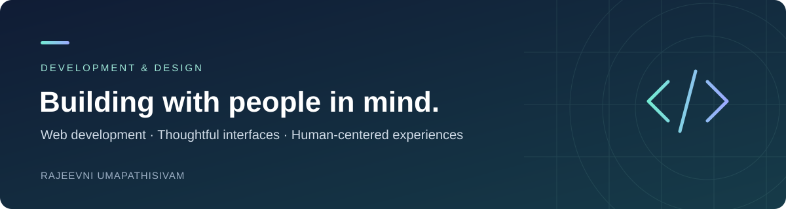

  

<h1 align="center">Hi, I'm Rajeevni Umapathisivam</h1>

  <strong>IT undergraduate · Full-stack web development · UI/UX &amp; HCI</strong> 
  BSc (Hons) in Information Technology · University of Vavuniya, Sri Lanka

  <a href="https://rajeevniumapathisivam.github.io/portfolio/">View portfolio</a> &nbsp; / &nbsp;
  <a href="#selected-projects">Explore projects</a> &nbsp; / &nbsp;
  <a href="https://github.com/RajeevniUmapathisivam?tab=repositories">All repositories</a>

---

## About me

I build web applications with a focus on clear interfaces and useful everyday experiences. As an IT undergraduate at the **University of Vavuniya**, I'm developing my skills across frontend development, backend systems, and user experience design.

I'm especially interested in **Human–Computer Interaction**: understanding how people use technology and bringing that understanding into the applications I build.

## Selected projects

### [EduEnrollPro](https://github.com/RajeevniUmapathisivam/EduEnrollPro)
**A course registration system for students and administrators.**

A full-stack application covering course enrollment, administrative approvals, dashboard analytics, and notifications, with separate frontend and backend applications.

`React` `JavaScript` `Node.js` `Express` `MongoDB` `JWT`

[Explore the repository →](https://github.com/RajeevniUmapathisivam/EduEnrollPro)

### [Personal portfolio](https://github.com/RajeevniUmapathisivam/portfolio)
**My projects, skills, and academic journey in one place.**

A responsive portfolio built with React and CSS, published through GitHub Pages.

`React` `JavaScript` `CSS` `GitHub Pages`

[Visit the website →](https://rajeevniumapathisivam.github.io/portfolio/) &nbsp; · &nbsp; [View source →](https://github.com/RajeevniUmapathisivam/portfolio)

### [Movie app](https://github.com/RajeevniUmapathisivam/Movie-app)
**A movie application project built with TypeScript.**

`TypeScript`

[Explore the repository →](https://github.com/RajeevniUmapathisivam/Movie-app)

## Technologies & tools

| Area | Technologies |
| :--- | :--- |
| Frontend | JavaScript, HTML, CSS, React |
| Backend & data | Node.js, Express, MongoDB |
| Programming | Python, TypeScript |
| Design & workflow | Figma, Git, GitHub, VS Code |

## Learning & interests

- **Frontend development:** building reusable React components and improving application structure.
- **Accessible interfaces:** applying UI/UX principles to make web experiences easier to use.
- **Deployment:** exploring cloud platforms and web application delivery.
- **HCI:** connecting academic research with practical, user-centered design.

## Let's connect

I'm open to collaborating on web applications, open-source projects, and HCI research initiatives.

Explore my [portfolio](https://rajeevniumapathisivam.github.io/portfolio/) to learn more about my work, or browse my [repositories](https://github.com/RajeevniUmapathisivam?tab=repositories).

---

Thoughtful interfaces. Practical applications. Continuous learning.

