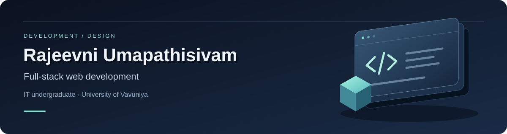

# Rajeevni Umapathisivam

**IT undergraduate · Full-stack web development**

I'm pursuing a BSc (Hons) in Information Technology at the University of Vavuniya, Sri Lanka. I build web applications with React, Node.js, and Express, with an interest in usable interfaces and user-centered design.

I'm seeking internships and junior software development opportunities, and welcome academic collaboration in UI/UX and Human–Computer Interaction (HCI).

[Portfolio](https://rajeevniumapathisivam.github.io/portfolio/) · [LinkedIn](https://www.linkedin.com/in/rajeevni-umapathisivam) · [Email](mailto:urajeevni@gmail.com)

## Selected projects

### [ConnectHub](https://github.com/RajeevniUmapathisivam/connecthub)

A video conferencing and collaboration platform with screen sharing, room chat, file sharing, and a shared whiteboard.

**Technologies:** React, Node.js, Express, MongoDB, Socket.io, WebRTC.

### [EduEnrollPro](https://github.com/RajeevniUmapathisivam/EduEnrollPro)

A course registration system for university students and administrators, with course enrollment, approval workflows, dashboard analytics, and JWT authentication.

**Technologies:** React, JavaScript, Node.js, Express, MongoDB.

### [Personal portfolio](https://github.com/RajeevniUmapathisivam/portfolio)

A responsive website presenting my projects, technical skills, and education, with light and dark themes.

**Technologies:** React, JavaScript, CSS, Framer Motion, GitHub Pages. [View website](https://rajeevniumapathisivam.github.io/portfolio/).

## Technical skills

- **Frontend:** JavaScript, TypeScript, React, HTML, CSS
- **Backend and data:** Node.js, Express, MongoDB, REST APIs, JWT authentication
- **Tools and design:** Git, GitHub, VS Code, Figma

## Academic interests

Full stack development, UI/UX, accessible interfaces, and user-centered web application design.

## Education

**B.Sc. (Hons) in Information Technology**  
Faculty of Applied Science, University of Vavuniya · 2023 – Present  
*Selected for the IT Honours programme in 2026.*

**G.C.E. Advanced Level — Physical Science** · 2021  
Combined Mathematics, Physics, Chemistry.

## Certifications

- **JavaScript Essentials 1**
- **Introduction to SQL** — Sololearn

## Competitions

- **IEEEXtreme 18.0** — Participant, **SheSupports**. Placed among the **top 2 teams at the University of Vavuniya**.
- **Hydra CTF 2026** — Participant, **SQUAD SYNTAX**.

## Let's connect

I'm open to **internships and junior developer roles** in full-stack, frontend, and backend development — **remote or on-site in Sri Lanka**.

Get in touch about an opportunity, an academic collaboration, or a project.

| Channel | Details |
| --- | --- |
| Email | [urajeevni@gmail.com](mailto:urajeevni@gmail.com) |
| Phone | +94 778 280 888 |
| LinkedIn | [Rajeevni Umapathisivam](https://www.linkedin.com/in/rajeevni-umapathisivam) |
| GitHub | [RajeevniUmapathisivam](https://github.com/RajeevniUmapathisivam) |
| Location | Trincomalee, Sri Lanka |

I welcome conversations about **full-stack development, React, REST APIs, database design, and user-centered interfaces**.

[Visit my portfolio](https://rajeevniumapathisivam.github.io/portfolio/)
